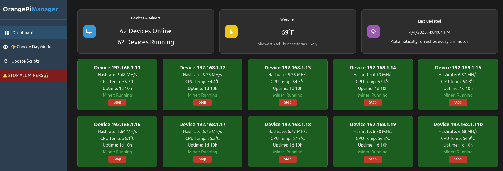

# OrangePiManager

A web-based monitoring and management system for Orange Pi mining devices on your local network.



## Table of Contents
1. [Quick Start](#quick-start)
2. [Setup](#setup)
3. [Features](#features)
4. [User Interface](#user-interface)
5. [API Reference](#api-reference)
6. [Security Considerations](#security-considerations)
7. [Troubleshooting](#troubleshooting)
8. [Contributing](#contributing)
9. [License](#license)

## Quick Start

1. Clone the repository:
```bash
git clone https://github.com/ComputerGenieCo/OrangePiManager.git
cd OrangePiManager
```

2. Create a `config.json` file in the project directory. Refer to the **Setup** section for details.

3. Start the server:
```bash
npm start
```

4. Open the web interface in your browser:
```
http://localhost:3000
```

## Setup

### Requirements

- **Host System**:
  - Node.js 20+ (LTS) ([Download Node.js](https://nodejs.org/en/download))
  - `sshpass` installed
  - Network access to Orange Pi devices

- **Orange Pi Devices**:
  - SSH access enabled
  - `tmux` installed
  - `tmux-resurrect` ([Download tmux-resurrect](https://github.com/tmux-plugins/tmux-resurrect.git))
  - `ccminer` configured ([Download ccminer](https://github.com/Oink70/CCminer-ARM-optimized.git))
  - Common subnet (default: 192.168.3.0/24)

### Configuration

The application uses a `config.json` file for configuration. Place this file in the root of the project directory. Below is an example structure:

```json
{
    "port": 3000,
    "ssh": {
        "user": "orangepi",
        "pass": "your-password",
        "maxRetries": 2
    },
    "network": {
        "start": "192.168.3.1",
        "end": "192.168.3.254"
    },
    "refreshInterval": 300000,
    "location": {
        "zipCode": "90210"
    }
}
```

### Configuration Fields
- **port**: The port number for the web server.
- **ssh**: SSH credentials for accessing Orange Pi devices.
  - `user`: SSH username.
  - `pass`: SSH password.
  - `maxRetries`: Maximum number of SSH retries.
- **network**: Network range for device discovery.
  - `start`: Starting IP address.
  - `end`: Ending IP address.
- **refreshInterval**: Interval (in milliseconds) for automatic device updates.
- **location**: Location settings for weather data.
  - `zipCode`: ZIP code for local weather.

## Features

### Core Functionality
- Automatic device discovery on the local network
- Real-time monitoring and control of mining devices
- Batch operations for miners
- Environmental monitoring integration (local weather)

### Monitoring Features
- **CPU Temperature Monitoring**:
  - Normal: Below 65°C (green)
  - Warning: 65°C-74°C (orange)
  - High: 75°C-81°C (red)
  - Critical: 82°C+ (bright red)
- **Mining Statistics**:
  - Hashrate (KH/s, MH/s, TH/s)
  - System uptime
  - Miner status
- **Environmental Data**:
  - Local temperature
  - Weather conditions
  - 30-minute forecast updates

### Control Features
- Individual miner management (start/stop)
- Batch operations (start/stop all miners)
- Emergency shutdown capability
- Remote script deployment
- Fast refresh during operations (2-second intervals for 30 seconds)

## User Interface

### Dashboard
- **Device Status**: Displays the number of devices online and miners running.
- **Weather**: Shows the current temperature and forecast.
- **Last Update**: Indicates the last time device data was refreshed.

### Controls
- **Start/Stop Miners**: Start or stop miners individually or in bulk.
- **Update Scripts**: Deploy updated scripts to all devices.
- **Theme Toggle**: Switch between light and dark modes.

### Notifications
- Toast notifications provide feedback for actions (e.g., miner control, script updates).

## API Reference

### Endpoints

| Endpoint | Method | Description |
|----------|--------|-------------|
| `/api/devices` | GET | Retrieve device status and metrics. |
| `/api/weather` | GET | Retrieve local weather data. |
| `/api/config` | GET | Retrieve server configuration. |
| `/api/miner/:ip/:action` | POST | Control miner states (start/stop). |
| `/api/miner/startall` | POST | Start all miners. |
| `/api/miner/killall` | POST | Stop all miners. |
| `/api/miner/update-scripts` | POST | Update scripts on all devices. |

### Example Responses

#### `/api/devices`
```json
{
    "devices": [
        {
            "ip": "192.168.3.100",
            "temp": 65.2,
            "uptime": 345600,
            "hashrate": 125000,
            "minerStatus": true,
            "lastUpdate": 1677721600000
        }
    ],
    "lastUpdateTime": "3/2/2025, 12:00:00 PM"
}
```

#### `/api/weather`
```json
{
    "temp": 72,
    "forecast": "Partly Cloudy",
    "lastUpdate": 1677721600000
}
```

#### `/api/miner/update-scripts`
```json
{
    "success": true,
    "errors": []
}
```

## Security Considerations

- Designed for trusted local networks only.
- Change default SSH passwords on all devices.
- Consider implementing SSH key authentication.
- Monitor system logs for unauthorized access.

## Troubleshooting

### Common Issues

1. **Devices Not Discovered**:
   - Verify SSH credentials.
   - Check network configuration.
   - Ensure `sshpass` is installed.
   - Test manual SSH access.

2. **Miners Not Responding**:
   - Verify `tmux` installation.
   - Check `ccminer` configuration.
   - Review script permissions.
   - Monitor system resources.

3. **Weather Data Missing**:
   - Validate ZIP code in `config.json`.
   - Check internet connectivity.
   - Review API rate limits.

## Contributing

1. Fork the repository.
2. Create a feature branch.
3. Commit changes.
4. Submit a pull request.

## License

Copyright (C) 2025 ComputerGenieCo  
Licensed under GNU GPL v3. See [LICENSE](LICENSE) for details.
